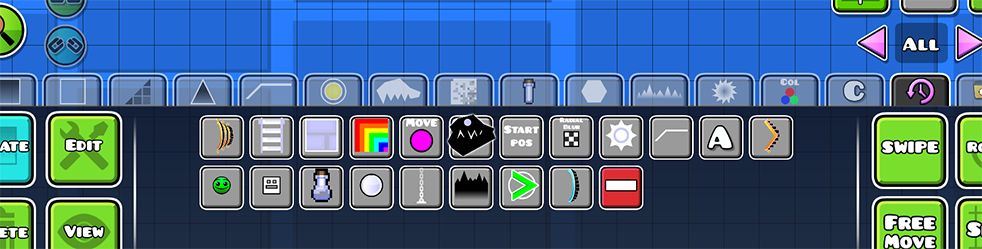

# Recent Objects

While building something in editor, you often use specific objects repeatedly.
Quick access to these objects reduces the time spent searching through extensive menus, 
making the level creation process faster and more efficient.

## Contribution

- You can report a bug or suggest a feature on my [Discord server](https://discord.gg/wcWvtKHP8n)
- You can contribute to the code on [GitHub](https://github.com/RazoomGD/geode-object-groups)